# 🚀 Accessing Amazon S3 from a VPC using a Gateway VPC Endpoint

## 📌 Project Overview

This project demonstrates how to access an Amazon S3 bucket from an Amazon Linux EC2 instance inside a VPC using an S3 Gateway VPC Endpoint.

The practical includes VPC configuration, route table configuration, an S3 Gateway VPC Endpoint, IAM role-based access, and AWS CLI testing from the EC2 instance.

---

## 🎯 Objective

- Create and configure an S3 bucket.
- Configure an S3 Gateway VPC Endpoint.
- Associate the endpoint with the required route table.
- Create an IAM role for the EC2 instance.
- Allow the EC2 instance to access the S3 bucket.
- Test S3 access using AWS CLI.
- Upload and download an object between EC2 and S3.
- Verify the complete connectivity and access flow.

---

## ☁️ AWS Services Used

- 🖥️ Amazon EC2
- 🌐 Amazon VPC
- 🪣 Amazon S3
- 🔗 VPC Gateway Endpoint
- 🔐 AWS IAM
- 💻 AWS CLI
- 🐧 Amazon Linux

---

## 🏗️ Architecture

The architecture consists of an Amazon Linux EC2 instance running inside a VPC. The EC2 instance uses an IAM role for authentication and communicates with Amazon S3 through an S3 Gateway VPC Endpoint.

### 🔄 Architecture Flow

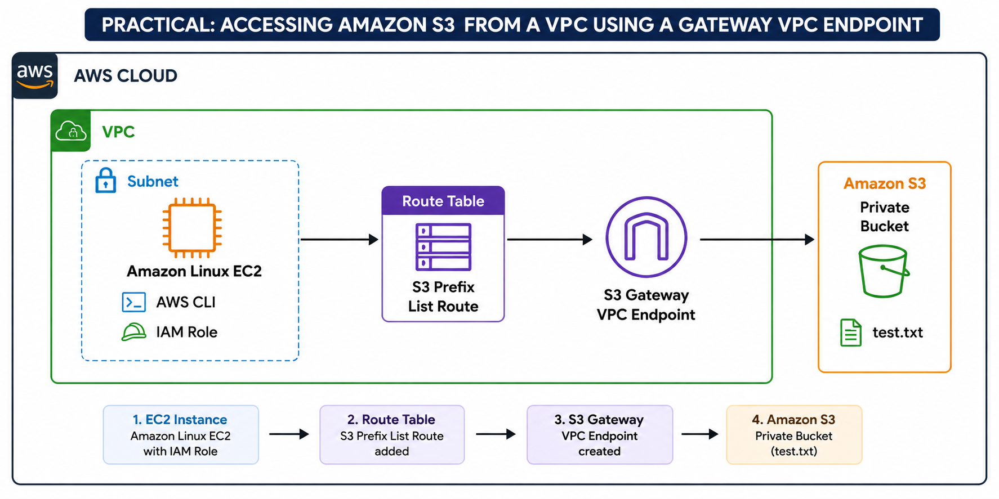

## ⚙️ Implementation Steps

### 1️⃣ S3 Bucket Configuration

Created a private Amazon S3 bucket and kept **Block Public Access enabled**.

### 2️⃣ VPC & Subnet Verification

Used the existing VPC and subnet containing the Amazon Linux EC2 instance and verified their configuration.

### 3️⃣ Route Table Configuration

Checked the route table associated with the EC2 subnet and verified the existing routes.

### 4️⃣ S3 Gateway VPC Endpoint

Created an **S3 Gateway VPC Endpoint** and associated it with the required route table.

### 5️⃣ Verify S3 Endpoint Route

Verified that the S3 prefix-list route was added to the route table and points to the Gateway Endpoint.

### 6️⃣ IAM Role Configuration

Created an IAM role for the EC2 instance with the required S3 permissions.

### 7️⃣ Attach IAM Role to EC2

Attached the IAM role to the Amazon Linux EC2 instance so that AWS CLI can access S3 using temporary credentials.

---

## 💻 Testing from Amazon Linux EC2

After completing the AWS configuration, I tested S3 access from the EC2 instance using AWS CLI.

### 🔐 Verify IAM Identity

~~~bash
aws sts get-caller-identity
~~~

**Use:** Verifies the IAM identity being used by the EC2 instance.

### 🪣 2. Check S3 Bucket

~~~bash
aws s3 ls s3://YOUR-BUCKET-NAME/
~~~

**Use:** Lists the objects available in the specified S3 bucket.

### 📝 3. Create a Test File

~~~bash
echo "YOUR CONTENT" > YOUR-FILE.txt
~~~

**Use:** Creates a test file and writes the specified content into it.

### 👀 4. View File Content

~~~bash
cat YOUR-FILE.txt
~~~

**Use:** Displays the content of the test file.

### ⬆️ 5. Upload File to S3

~~~bash
aws s3 cp YOUR-FILE.txt s3://YOUR-BUCKET-NAME/
~~~

**Use:** Uploads the file from the EC2 instance to the S3 bucket.

### ✅ 6. Verify Upload

~~~bash
aws s3 ls s3://YOUR-BUCKET-NAME/
~~~

**Use:** Confirms that the file was successfully uploaded to S3.

### ⬇️ 7. Download File from S3

~~~bash
aws s3 cp s3://YOUR-BUCKET-NAME/YOUR-FILE.txt DOWNLOADED-FILE.txt
~~~
**Use:** Downloads the file from S3 to the EC2 instance.

### 🔎 8. Verify Downloaded File

~~~bash
cat DOWNLOADED-FILE.txt
~~~

**Use:** Displays the downloaded file content and confirms that the file was transferred successfully.

---

## 🔐 Security Configuration

- 🔒 S3 Block Public Access was kept enabled.
- 🔑 EC2 accessed S3 through an IAM role.
- 🚫 No permanent AWS access keys were stored on the EC2 instance.
- 🔗 S3 connectivity was configured through a Gateway VPC Endpoint.
- 🛡️ S3 permissions were controlled through IAM.

---

## 📸 Images of the Project

### 🪣 S3 Bucket Creation

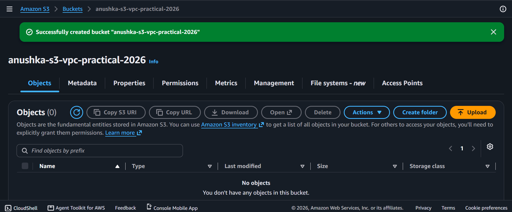

### 🔗 S3 Gateway VPC Endpoint

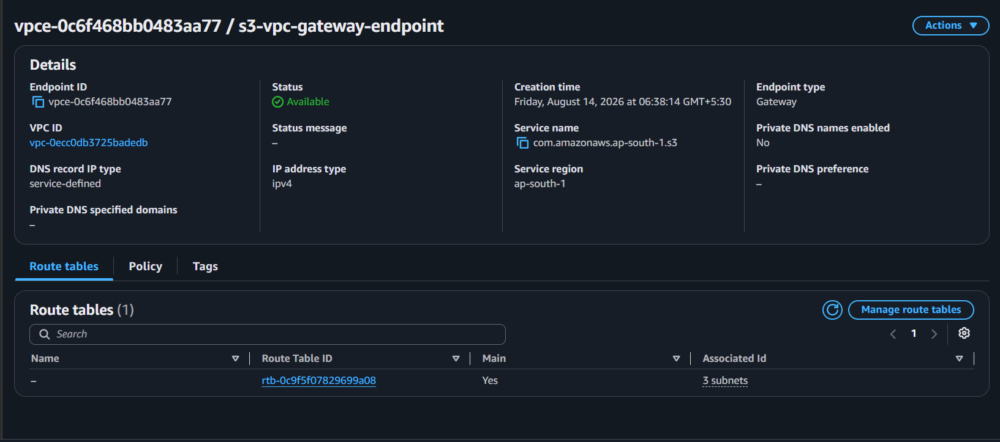

### 🛣️ Route Table with S3 Endpoint Route

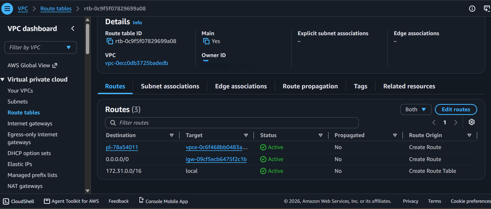

### 🔐 IAM Role Configuration

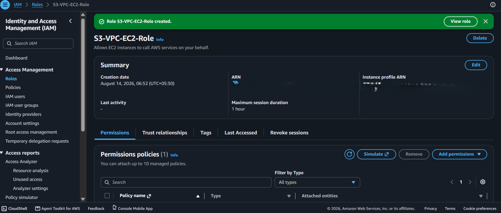

### 🆔 IAM Identity Verification

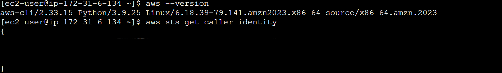

### 💻 S3 CLI File Creation

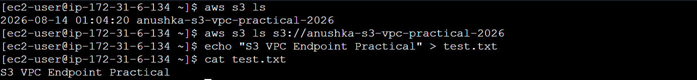

### ⬆️ S3 Upload Verification

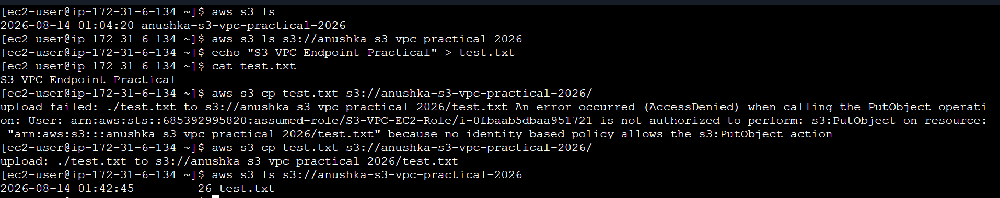

### ⬇️ S3 File Download Verification

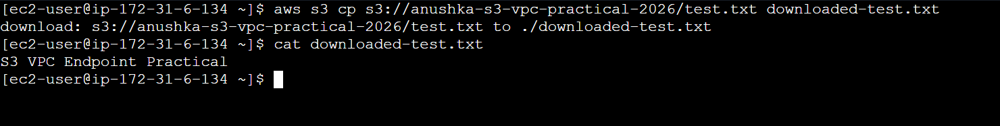

### 🪣 S3 Object in Bucket

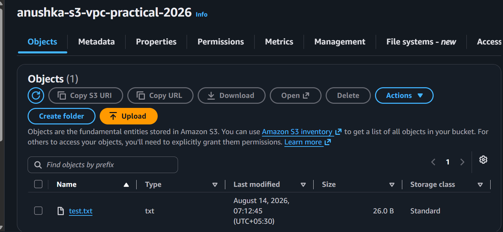

### 🌐 S3 Object Access

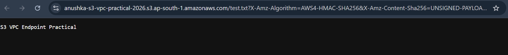

---

## 📚 Key Learnings

- 🌐 Configured VPC networking for Amazon S3 access.
- 🔗 Created and configured an S3 Gateway VPC Endpoint.
- 🛣️ Worked with route tables and S3 prefix-list routes.
- 🔐 Configured IAM role-based access for EC2.
- 🐧 Used Amazon Linux and AWS CLI.
- 🪣 Performed S3 upload and download operations.
- 🛡️ Applied private and controlled access to S3.

---

## 🏁 Conclusion

Successfully configured and tested access to an Amazon S3 bucket from an Amazon Linux EC2 instance using an **S3 Gateway VPC Endpoint** and **IAM role-based authentication**.

This practical provided hands-on experience with **VPC networking, IAM, EC2, S3, route tables, Gateway Endpoints, and AWS CLI**. 🚀

